<div align="center">

# Daniel Netto

**Software Developer & Maker**

`🔧 Systems`&ensp;·&ensp;`⚡ Embedded`&ensp;·&ensp;`🌐 Web`&ensp;·&ensp;`🎮 Game Dev`

<br>

</div>

---

### 👨‍💻 About

- 🔭 Currently working on [Little App](https://github.com/dnettoRaw/littleApp) and [Primland](https://github.com/primland) projects
- 🌱 Learning **Unreal Engine** and diving deeper into **Rust**
- 💬 Ask me about **C, Shell Script, Arduino, Hardware Design**
- 📫 Reach me at **contact@dnetto.dev**
- 🌐 Portfolio at **[portfolio.dnetto.dev](https://portfolio.dnetto.dev)**

---

### 🛠️ Tech Stack

```
 Languages    C · C++ · C# · Rust · TypeScript · Python · Shell
 Frontend     React · Vue · Next.js · Nuxt · HTML · CSS · JS
 Backend      Node.js · .NET · REST · GraphQL
 Data         PostgreSQL · MongoDB · MySQL · SQLite · MSSQL
 Infra        Docker · AWS · Linux · Git
 Hardware     Arduino · Embedded Systems · PCB Design
 Engines      Unreal Engine · Electron
```

---

### 📊 GitHub Stats

<div align="center">
  
  <br/>
  
</div>

---

### 📅 Contributions

<div align="center">
  
</div>

---

### 💡 Coding Habits

<div align="center">
  
</div>

---

### 🏆 Achievements

<div align="center">
  
</div>

---

### ⏱️ Weekly Dev Stats

<!--START_SECTION:waka-->
<!--END_SECTION:waka-->

---

<div align="center">

### 🔗 Connect

📧 [contact@dnetto.dev](mailto:contact@dnetto.dev)&ensp;·&ensp;🌐 [Portfolio](https://portfolio.dnetto.dev)&ensp;·&ensp;💻 [GitHub](https://github.com/dnettoRaw)&ensp;·&ensp;📚 [Stack Overflow](https://stackoverflow.com/users/14931083)&ensp;·&ensp;✍️ [DEV](https://dev.to/dnettoraw)

---

<sub>◆ Open to collaborations on interesting projects · Not looking for hire ◆</sub>

</div>
