<div align="center">

# Daniel Netto

**Software Developer & Maker**

`🔧 Systems`&ensp;·&ensp;`⚡ Embedded`&ensp;·&ensp;`🌐 Web`&ensp;·&ensp;`🎮 Game Dev`

<br>

</div>

---

### 👨‍💻 About

- 🔭 Currently working on [Little App](https://github.com/dnettoRaw/littleApp) and [Primland](https://github.com/primland) projects
- 🌱 Learning **Unreal Engine** and diving deeper into **Rust**
- 💬 Ask me about **C, Shell Script, Arduino, Hardware Design**
- 📫 Reach me at **contact@dnetto.dev**
- 🌐 Portfolio at **[portfolio.dnetto.dev](https://portfolio.dnetto.dev)**

---

### 🛠️ Tech Stack

```
 Languages    C · C++ · C# · Rust · TypeScript · Python · Shell
 Frontend     React · Vue · Next.js · Nuxt · HTML · CSS · JS
 Backend      Node.js · .NET · REST · GraphQL
 Data         PostgreSQL · MongoDB · MySQL · SQLite · MSSQL
 Infra        Docker · AWS · Linux · Git
 Hardware     Arduino · Embedded Systems · PCB Design
 Engines      Unreal Engine · Electron
```

---

### 📊 GitHub Stats


<div align="center">
  
  <br/>
  
  <br/>
  
</div>

---

### 📅 Contributions

<div align="center">
  
</div>

---

### 🏆 Notable Contributions

<div align="center">
  
</div>

---

### 💡 Recent Activity

<div align="center">
  
</div>

---

### ⏱️ Weekly Dev Stats

<!--START_SECTION:waka-->


**🐱 My GitHub Data** 

> 📦 732.1 kB Used in GitHub's Storage 
 > 
> 🏆 351 Contributions in the Year 2026
 > 
> 🚫 Not Opted to Hire
 > 
> 📜 78 Public Repositories 
 > 
> 🔑 79 Private Repositories 
 > 
**I'm an Early 🐤** 

```text
🌞 Morning                3183 commits        ⣿⣿⣿⣿⣿⣿⣿⣿⣿⣿⣀⣀⣀⣀⣀⣀⣀⣀⣀⣀⣀⣀⣀⣀⣀   38.75 % 
🌆 Daytime                2765 commits        ⣿⣿⣿⣿⣿⣿⣿⣿⣀⣀⣀⣀⣀⣀⣀⣀⣀⣀⣀⣀⣀⣀⣀⣀⣀   33.66 % 
🌃 Evening                1024 commits        ⣿⣿⣿⣀⣀⣀⣀⣀⣀⣀⣀⣀⣀⣀⣀⣀⣀⣀⣀⣀⣀⣀⣀⣀⣀   12.47 % 
🌙 Night                  1243 commits        ⣿⣿⣿⣿⣀⣀⣀⣀⣀⣀⣀⣀⣀⣀⣀⣀⣀⣀⣀⣀⣀⣀⣀⣀⣀   15.13 % 
```
📅 **I'm Most Productive on Friday** 

```text
Monday                   418 commits         ⣿⣀⣀⣀⣀⣀⣀⣀⣀⣀⣀⣀⣀⣀⣀⣀⣀⣀⣀⣀⣀⣀⣀⣀⣀   05.09 % 
Tuesday                  1263 commits        ⣿⣿⣿⣿⣀⣀⣀⣀⣀⣀⣀⣀⣀⣀⣀⣀⣀⣀⣀⣀⣀⣀⣀⣀⣀   15.37 % 
Wednesday                658 commits         ⣿⣿⣀⣀⣀⣀⣀⣀⣀⣀⣀⣀⣀⣀⣀⣀⣀⣀⣀⣀⣀⣀⣀⣀⣀   08.01 % 
Thursday                 686 commits         ⣿⣿⣀⣀⣀⣀⣀⣀⣀⣀⣀⣀⣀⣀⣀⣀⣀⣀⣀⣀⣀⣀⣀⣀⣀   08.35 % 
Friday                   4211 commits        ⣿⣿⣿⣿⣿⣿⣿⣿⣿⣿⣿⣿⣿⣀⣀⣀⣀⣀⣀⣀⣀⣀⣀⣀⣀   51.26 % 
Saturday                 541 commits         ⣿⣿⣀⣀⣀⣀⣀⣀⣀⣀⣀⣀⣀⣀⣀⣀⣀⣀⣀⣀⣀⣀⣀⣀⣀   06.59 % 
Sunday                   438 commits         ⣿⣀⣀⣀⣀⣀⣀⣀⣀⣀⣀⣀⣀⣀⣀⣀⣀⣀⣀⣀⣀⣀⣀⣀⣀   05.33 % 
```


📊 **This Week I Spent My Time On** 

```text
💬 Programming Languages: 
Rust                     11 hrs 2 mins       ⣿⣿⣿⣿⣿⣿⣿⣿⣿⣿⣿⣿⣿⣿⣀⣀⣀⣀⣀⣀⣀⣀⣀⣀⣀   54.33 % 
Makefile                 2 hrs 36 mins       ⣿⣿⣿⣀⣀⣀⣀⣀⣀⣀⣀⣀⣀⣀⣀⣀⣀⣀⣀⣀⣀⣀⣀⣀⣀   12.81 % 
Other                    2 hrs 22 mins       ⣿⣿⣿⣀⣀⣀⣀⣀⣀⣀⣀⣀⣀⣀⣀⣀⣀⣀⣀⣀⣀⣀⣀⣀⣀   11.68 % 
TypeScript               1 hr 20 mins        ⣿⣿⣀⣀⣀⣀⣀⣀⣀⣀⣀⣀⣀⣀⣀⣀⣀⣀⣀⣀⣀⣀⣀⣀⣀   06.61 % 
JSON                     55 mins             ⣿⣀⣀⣀⣀⣀⣀⣀⣀⣀⣀⣀⣀⣀⣀⣀⣀⣀⣀⣀⣀⣀⣀⣀⣀   04.56 % 

🔥 Editors: 
VS Code                  15 hrs 32 mins      ⣿⣿⣿⣿⣿⣿⣿⣿⣿⣿⣿⣿⣿⣿⣿⣿⣿⣿⣿⣀⣀⣀⣀⣀⣀   76.49 % 
Antigravity              4 hrs 46 mins       ⣿⣿⣿⣿⣿⣿⣀⣀⣀⣀⣀⣀⣀⣀⣀⣀⣀⣀⣀⣀⣀⣀⣀⣀⣀   23.51 % 

💻 Operating System: 
Mac                      20 hrs 19 mins      ⣿⣿⣿⣿⣿⣿⣿⣿⣿⣿⣿⣿⣿⣿⣿⣿⣿⣿⣿⣿⣿⣿⣿⣿⣿   100.00 % 
```

**Timeline**


 Last Updated on 23/04/2026 16:10:49 UTC
<!--END_SECTION:waka-->

---

<div align="center">

### 🔗 Connect

📧 [contact@dnetto.dev](mailto:contact@dnetto.dev)&ensp;·&ensp;🌐 [Portfolio](https://portfolio.dnetto.dev)&ensp;·&ensp;💻 [GitHub](https://github.com/dnettoRaw)&ensp;·&ensp;📚 [Stack Overflow](https://stackoverflow.com/users/14931083)&ensp;·&ensp;✍️ [DEV](https://dev.to/dnettoraw)

---

<sub>◆ Open to collaborations on interesting projects · Not looking for hire ◆</sub>

</div>
